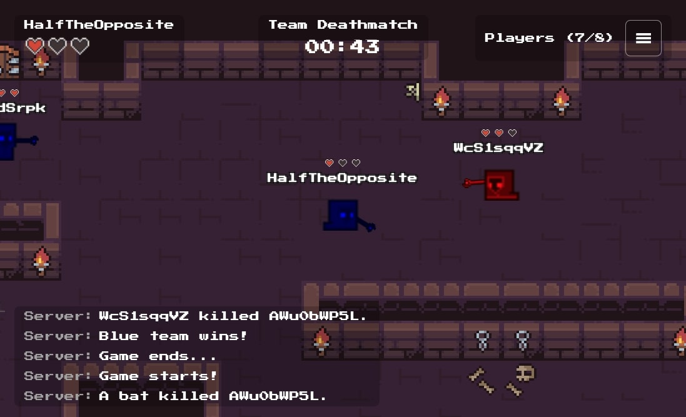
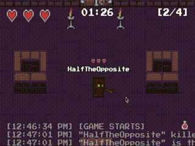

# TOSIOS


The Open-Source IO Shooter is an open-source multiplayer game in the browser. It is meant to be hostable and playable by (almost) anyone. This is not an attempt at creating an outstanding gaming experience, but to create an easily understandable and modifiable multiplayer browser game.



## Building

**Docker**

Run `docker build -t tosios .`

**Local (Yarn is required)**

Run `yarn && yarn build`

## Running

**Docker**

Run `docker run -d -p 3001:3001 [IMAGE_ID]`

The `-d` option will run the container in the background (recommended if you want to have access to your current terminal session).

The `-p` option will let you choose on which port the container will listen (e.g. the first `3001` will make it accessible to `http://localhost:3001`), and on which internal port must the server listen (e.g. the second `3001`).

The `[IMAGE_ID]` is easily discoverable by running `docker images` in the terminal.

**Local**

Run `yarn serve`.

**Tips**

To get your local IP you can run `ipconfig getifaddr en0`.

## Playing

Move: <kbd>W</kbd> <kbd>A</kbd> <kbd>S</kbd> <kbd>D</kbd> or <kbd>↑</kbd> <kbd>←</kbd> <kbd>↓</kbd> <kbd>→</kbd>.

Aim: <kbd>Mouse</kbd>

Shoot: <kbd>Left click</kbd>



## Project architecture

This project is a monorepo (with the help of Yarn workspaces). It contains the following packages:

* `client` - A `Create React App` using `PIXI.js` and `Colyseus.js`.
* `server` - An `Express` app using `Colyseus`.
* `common` - A collection of constants and methods shared amongst `client` and `server`.

## Modding

### Maps

Maps are composed of `arrays` of `arrays` where each number greater than `0` represents a `wall` in which entities will collide.

Each number represents a specific wall sprite to be drawn:
* `1` for a wall on the left
* `2` for a wall on the top
* `3` for a wall on the right
* `4` for a wall on the bottom
* `7` for a wall on the bottom-left (concave angle)
* `8` for a wall on the bottom-right (concave angle)
* `9` for a wall on the top-left (convexe angle)
* `10` for a wall on the bottom-right (convexe angle)

Examples:
```json
  [
    [1, 2, 2, 2, 2, 3],
    [1, 0, 0, 0, 0, 3],
    [1, 0, 9, 10, 0, 3],
    [1, 0, 4, 4, 0, 3],
    [1, 0, 0, 0, 0, 3],
    [7, 4, 4, 4, 4, 8],
  ]
```

### Props

TODO

## Roadmap (Q3 2019)

This is not an exhaustive, nor final, features list but it will give you a good indication on what I am working on:
* Let users select the number of players in a room
* Let users choose a password for a room
* Add mobile mode (updated GUI and virtual joysticks)
* Add visual feedback when a player gets hit
* Add a Team Death Match mode
* Publish the docker image onto a registry and add a `docker-compose` file
* Add a playable demo(official) website for anyone to test and play the game

## Special thanks

Thanks to [@endel](https://github.com/endel) for his fabulous work on [Colyseus](https://github.com/colyseus/colyseus) that made this game possible.

Thanks to the [PIXI.js](https://github.com/pixijs/pixi.js) team for their incredible library and up-to-date documentation. 

Thanks to [@pixel_poem](https://twitter.com/pixel_poem) for the art package he published on Itch.io which made this game looks cool instantly.

## Licenses

This project is under the MIT license.

The major libraries used in this project have the following licenses:

* Colyseus: [MIT](https://github.com/colyseus/colyseus/blob/master/LICENSE)
* PIXI.js: [MIT](https://github.com/pixijs/pixi.js/blob/dev/LICENSE)
